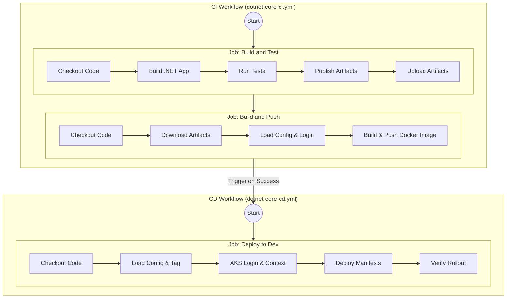

# .NET Core AKS CI/CD Pipeline Design Document

## 1. Introduction
This document outlines the architecture and design of the Continuous Integration/Continuous Delivery (CI/CD) pipeline for .NET Core applications targeting Azure Kubernetes Service (AKS) using GitHub Actions. The pipeline emphasizes modularity, security, and reusability to ensure a robust and efficient delivery process.

## 2. CI/CD Workflow Architecture and Design

### 2.1. Overall Structure
The CI/CD process is split into two distinct, but interconnected, GitHub Actions workflows:
- **Continuous Integration (CI) Workflow (`dotnet-core-ci.yml`):** Responsible for building, testing, and packaging the application, including the creation and pushing of Docker images to Azure Container Registry (ACR).
- **Continuous Delivery (CD) Workflow (`dotnet-core-cd.yml`):** Responsible for deploying the Docker image to a specified AKS cluster.

This clear separation enhances maintainability, allows for independent execution and troubleshooting, and promotes a pull-based deployment model where the CD pipeline consumes artifacts produced by CI.



### 2.2. Workflow Triggering
- **CI Workflow (`dotnet-core-ci.yml`):**
    - **`push` events:** Triggered on pushes to `main`, `develop`, and `master` branches. Uses path filtering (`paths: 'src/DotNetCoreApp/**'`) to only run when changes occur within the .NET Core application source, its workflow file, or custom actions. This optimizes resource consumption.
    - **`pull_request` events:** Triggers on pull requests targeting `main` and `master`, ensuring code quality checks before merging.
    - **`workflow_dispatch`:** Allows manual invocation with target environment selection (`dev`, `staging`, `prod`).

- **CD Workflow (`dotnet-core-cd.yml`):**
    - **`workflow_run` events:** Automatically triggers upon successful completion of the CI workflow on `main` or `master` branches.
    - **`workflow_dispatch`:** Supports manual deployment with optional image tag override for hotfixes or redeployments.

## 3. Reusability Patterns in Custom Actions

The pipeline uses custom composite GitHub Actions to encapsulate common, repeatable tasks, improving reusability and reducing redundancy:

- **`dotnet-build`:** Handles .NET SDK setup, NuGet package caching, dependency restoration, and application building. Ensures consistent build processes across environments.
- **`dotnet-test`:** Orchestrates test execution with optional code coverage collection and publishes test results as artifacts. Supports `--no-build` optimization.
- **`dotnet-publish`:** Manages publishing of .NET applications to specified output paths. Supports `--no-build` for efficiency.
- **`load-config`:** Parses `.github/config/environments.yml` to extract environment-specific settings (ACR name, AKS cluster, namespace). Centralizes configuration management and makes workflows environment-agnostic.

## 4. Build Pipeline Flow

### 4.1. CI Pipeline (Build and Test)
1. **Build and Test Job:**
   - Checkout code
   - Build application with Release configuration
   - Run tests with code coverage collection
   - Publish application artifacts to output directory
   - Upload build artifacts (1-day retention)

2. **Docker Image Build and Push Job:**
   - Depends on build-and-test job completion
   - Download published artifacts from the previous job
   - Load environment-specific configuration
   - Authenticate to Azure and ACR
   - Set up Docker Buildx for advanced build features
   - Build Docker image with GitHub Actions cache (`type=gha`)
   - Generate metadata tags (latest for main, branch, SHA)
   - Push image to ACR

### 4.2. CD Pipeline (Deployment to AKS)
1. **Deploy to Dev Job:**
   - Triggered by successful CI workflow completion
   - Load environment configuration
   - Determine image tag (from workflow input or calculated from SHA)
   - Authenticate to Azure
   - Set AKS cluster context with kubelogin
   - Convert kubeconfig to Service Principal authentication
   - Deploy Kubernetes manifests with environment variables
   - Wait for deployment rollout (300s timeout) with automatic rollback on failure
   - Output deployment summary

## 5. Dockerfile Design and Best Practices

The `Dockerfile` is optimized for production ASP.NET Core containerization:

- **Base Image:** `mcr.microsoft.com/dotnet/aspnet:9.0` - minimal runtime image providing lean deployments
- **Artifact-based Build Strategy:** The Dockerfile copies pre-built artifacts from the CI pipeline (`COPY publish .`). This keeps the runtime image small and delegates the build process to the CI workflow, ensuring that the deployed code is exactly what was tested.
- **Non-root User:** Dedicated `appuser` (UID 1000, GID 1000) runs the application - critical security practice
- **Port Configuration:** Application listens on port `8080` (non-privileged port)
- **Health Checks:**
    - Dockerfile `HEALTHCHECK` uses `curl` to check `http://localhost:8080/health`.
    - Kubernetes Probes (Liveness/Readiness/Startup) are configured to use `/health/live`, `/health/ready`, and `/health`.
- **Entry Point:** `ENTRYPOINT ["dotnet", "DotNetCoreApp.dll"]`

### 5.1. Security Features in Dockerfile
- Non-root execution reduces container compromise impact
- Health check enables Kubernetes readiness/liveness probes
- Non-privileged port compliance
- Lean runtime base image minimizes attack surface

## 6. Configuration Management

The pipeline uses centralized configuration through `.github/config/environments.yml`:

### 6.1. Structure
```yaml
dev:
  key-vault-name: kv-dev
  dotnet-core:
    acr-name: <registry>
    aks-cluster: <cluster-name>
    resource-group: <rg-name>
    namespace: dev
    image-tag-suffix: dev
```

### 6.2. Configuration Loading
- `load-config` action parses YAML and outputs environment-specific values
- Supports multiple application types (dotnet-core, vbnet)
- Enables environment parity with single configuration source

## 7. Security Posture

### 7.1. Authentication & Authorization
- **Azure Access:** Service Principal authentication via GitHub Secrets (`AZURE_CREDENTIALS`)
- **ACR Access:** Azure login method inherited from azure/login action
- **AKS Access:** kubelogin with Service Principal conversion - avoids direct credential exposure
- **Credential Masking:** GitHub Actions secrets management prevents logging of sensitive values

### 7.2. Image Security
- Non-root user execution
- Minimal base image (runtime-only)
- Health check for Kubernetes pod verification

### 7.3. Least Privilege
- Custom actions encapsulate specific operations
- Environment-based RBAC through Azure configuration
- Restricted path triggers reduce unnecessary runs

## 8. Integration Patterns

### 8.1. Azure Container Registry (ACR)
- Centralized, private Docker image repository
- Dynamic configuration per environment
- Consistent tagging strategy (latest, branch, SHA)
- GitHub Actions cache for build efficiency

### 8.2. Azure Kubernetes Service (AKS)
- Deployment target for containerized applications
- Environment-specific cluster configuration
- kubelogin integration for automated authentication
- Manifest-based deployment with envsubst templating
- Rollout status verification with automatic rollback on failure
- Deployment annotation tracking via `kubernetes.io/change-cause`

### 8.3. GitHub Actions Integration
- Reusable workflows for CI/CD separation
- Artifact management for build outputs (1-day retention)
- Summary reporting for visibility
- Cache optimization for dependencies

## 9. Key Design Principles

1. **Modularity:** Separate CI and CD workflows with clear responsibilities
2. **Reusability:** Custom actions encapsulate common patterns
3. **Efficiency:** NuGet caching, --no-build flags, GitHub Actions cache
4. **Security:** Non-root users, Service Principal authentication, credential masking
5. **Traceability:** Image tagging by branch and SHA
6. **Flexibility:** Environment-based configuration management
7. **Reliability:** Rollout status verification, health checks, artifact retention

## 10. Technology Stack

| Component | Technology | Purpose |
|-----------|-----------|---------|
| CI/CD Platform | GitHub Actions | Workflow automation |
| Build Tool | dotnet CLI | .NET application build/test/publish |
| Container Registry | Azure Container Registry (ACR) | Docker image storage |
| Orchestration | Azure Kubernetes Service (AKS) | Container deployment |
| Authentication | Service Principal + kubelogin | Azure access |
| Configuration | YAML + PowerShell | Environment management |
| Container Image | ASP.NET Core 9.0 runtime | Application runtime |
