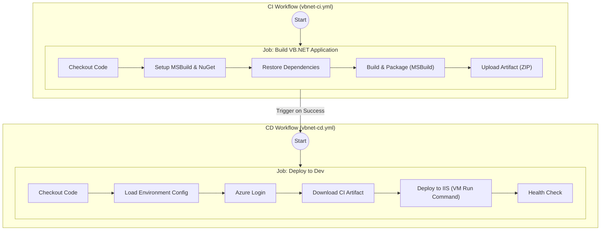

# VB.NET Azure VM CI/CD Pipeline Design Document

## 1. Introduction
This document outlines the architecture and design of the Continuous Integration/Continuous Delivery (CI/CD) pipeline for legacy VB.NET/ASP.NET applications targeting Azure Virtual Machines (IIS) using GitHub Actions. The pipeline emphasizes modularity, security, and reusability to ensure a robust and efficient delivery process for traditional .NET Framework applications.

## 2. CI/CD Workflow Architecture and Design

### 2.1. Overall Structure
The CI/CD process is split into two distinct, but interconnected, GitHub Actions workflows:
- **Continuous Integration (CI) Workflow (`vbnet-ci.yml`):** Responsible for building the VB.NET application using MSBuild, running tests (placeholder), and packaging the application into a deployable ZIP artifact.
- **Continuous Delivery (CD) Workflow (`vbnet-cd.yml`):** Responsible for deploying the ZIP artifact to a specified Azure VM running IIS.

This separation allows for independent build verification and promotes a "build once, deploy many" model where the same artifact is promoted across environments.



### 2.2. Workflow Triggering
- **CI Workflow (`vbnet-ci.yml`):**
    - **`push` events:** Triggered on pushes to `main`, `develop`, and `master` branches. Uses path filtering (`paths: 'src/VBNetApp/**'`) to only run when changes occur within the VB.NET application source or its workflow/actions.
    - **`pull_request` events:** Triggers on pull requests targeting `main` and `master`.
    - **`workflow_dispatch`:** Allows manual invocation.

- **CD Workflow (`vbnet-cd.yml`):**
    - **`workflow_run` events:** Automatically triggers upon successful completion of the `VB.NET CI` workflow on `main` or `master` branches.
    - **`workflow_dispatch`:** Supports manual deployment, allowing the user to specify a specific CI run ID to redeploy an older artifact.

## 3. Reusability Patterns in Custom Actions

The pipeline uses custom composite GitHub Actions to encapsulate complex logic:

- **`msbuild-build`:** Handles the legacy .NET build process.
    - Sets up MSBuild and NuGet.
    - Caches NuGet packages to speed up builds.
    - Restores dependencies.
    - Builds the solution with specified configuration/platform.
    - Repackages the build output into a clean, flat ZIP file ready for IIS deployment (handling legacy MSDeploy package structures).
- **`iis-deploy`:** Orchestrates the deployment to an Azure VM.
    - Verifies the VM is running.
    - Uploads the deployment package to Azure Blob Storage (staging).
    - Generates a short-lived SAS token for the blob.
    - Executes a PowerShell script on the VM via **Azure VM Run Command** to download the package and update the IIS site.
    - Cleans up the blob from storage.
    - Performs a health check against the application URL.
- **`load-config`:** Parses `.github/config/environments.yml` to extract environment-specific settings (VM name, resource group, etc.).
- **`download-workflow-artifact`:** Custom composite action using GitHub REST API to download artifacts from a separate workflow run. Replaces third-party `dawidd6/action-download-artifact` to comply with the whitelisted actions policy. Supports exact and wildcard artifact name matching.

## 4. Build Pipeline Flow

### 4.1. CI Pipeline (Build and Package)
1. **Build Job:**
   - Checkout code.
   - Invoke `msbuild-build` action:
     - Restore NuGet packages (cached).
     - Run MSBuild with `/p:DeployOnBuild=true /p:WebPublishMethod=Package`.
     - Extract the nested MSDeploy ZIP and repackage the content as a flat ZIP.
   - Upload the resulting `VBNetApp.zip` as a workflow artifact (`deployment-package-<sha>`) with 90-day retention.
   - Output a build summary.

### 4.2. CD Pipeline (Deployment to IIS)
1. **Deploy to Dev Job:**
   - Triggered by CI completion.
   - Checkout code (to access actions).
   - Load environment configuration (VM details, IIS settings).
   - Authenticate to Azure via Service Principal.
   - Download the specific artifact from the triggering CI run.
   - Invoke `iis-deploy` action:
     - **Staging:** Upload ZIP to Azure Blob Storage.
     - **Execution:** Trigger VM Run Command to pull the ZIP and deploy to IIS.
     - **Verification:** Health check via single HTTP request to application URL (non-200 logged as warning).

## 5. VM Deployment Strategy

Unlike containerized deployments, deploying to legacy VMs requires a different strategy to handle artifact transfer and execution securely:

- **Artifact-Based Deployment:** The application is fully built and packaged in the CI stage. The CD stage only moves and extracts files, ensuring binary consistency.
- **Azure Blob Storage as Staging:** Azure VM Run Command has a script size limit (checking for ~4KB-300KB depending on OS/API version, but generally small for binaries).
    - **Solution:** The `iis-deploy` action uploads the large application ZIP to a temporary container in Azure Blob Storage.
    - It generates a **SAS (Shared Access Signature) token** with a short expiration (30 mins).
    - The SAS URL is passed to the VM Run Command script.
- **VM Run Command:** This feature allows executing PowerShell scripts on the VM without opening inbound ports (RDP/WinRM) to the internet.
    - The script running on the VM downloads the ZIP from the SAS URL.
    - It creates a backup of the current deployment before making changes.
    - It stops the IIS App Pool, extracts the files to the web root, creates/updates the IIS application, and restarts the App Pool.
    - On failure, it automatically rolls back to the latest backup and restores the IIS application configuration.
    - The SAS URL is Base64-encoded before passing to VM Run Command to avoid `&` characters in SAS query strings breaking parameter parsing.

## 6. Configuration Management

The pipeline uses centralized configuration through `.github/config/environments.yml`:

### 6.1. Structure
```yaml
dev:
  vm-name: vm-dev-01
  resource-group: rg-dev-apps
  storage-account: stdevapps
  storage-container: deployments
  iis-app-name: VBNetApp-Dev
```

### 6.2. Configuration Loading
- `load-config` action parses this YAML.
- `iis-deploy` receives these values as inputs, keeping the workflow definition clean and environment-agnostic.

## 7. Security Posture

### 7.1. Authentication & Authorization
- **Azure Access:** Service Principal authentication via GitHub Secrets (`AZURE_CREDENTIALS`).
- **VM Access:** No direct RDP/SSH ports are opened. Deployment is triggered via the Azure Control Plane (Run Command), which is audited and RBAC-controlled.
- **Blob Storage:** Uses SAS tokens with tight expiry windows (30 mins) and read-only permissions for the VM to download artifacts.

### 7.2. Network Security
- **Outbound Only:** The GitHub Runner only needs outbound HTTPS access to Azure APIs.
- **No Inbound Access:** The VM does not need to accept connections from the GitHub Runner directly.

### 7.3. Least Privilege
- The Service Principal used by GitHub Actions should be scoped to the specific Resource Group containing the VM and Storage Account.

## 8. Integration Patterns

### 8.1. Azure Blob Storage
- Acts as a secure, temporary "drop zone" for deployment artifacts.
- Decouples the runner network from the VM network.

### 8.2. Azure VM (IIS)
- The target runtime environment.
- Managed via Azure VM Agent (Run Command).

### 8.3. GitHub Actions Integration
- **Artifacts:** usage of `actions/upload-artifact` and `download-workflow-artifact` to pass binaries between CI and CD.
- **Summaries:** Both workflows output detailed Step Summaries (Markdown) to the GitHub UI, providing immediate visibility into build versions, package sizes, and deployment status.

## 9. Key Design Principles

1. **Modularity:** CI and CD are decoupled. CI focuses on creating a valid package; CD focuses on delivery.
2. **Immutability (Artifacts):** The exact ZIP file created in CI is deployed to all environments.
3. **Security:** No open ports required on the VM. All control traffic goes through authenticated Azure APIs.
4. **Resilience:** The deployment script includes automatic rollback on failure (restores from backup) and post-deployment health checks.
5. **Traceability:** Deployment summaries link back to the source commit and CI run ID.

## 10. Technology Stack

| Component | Technology | Purpose |
|-----------|-----------|---------|
| CI/CD Platform | GitHub Actions | Workflow automation |
| Build Tool | MSBuild | VB.NET application build |
| Artifact Storage | Azure Blob Storage | Temporary staging for deployment |
| Target Host | Azure VM (Windows Server) | Hosting IIS |
| Deployment Mechanism | Azure VM Run Command | Remote execution on VM |
| Authentication | Service Principal | Azure access |
| Configuration | YAML + PowerShell | Environment management |
