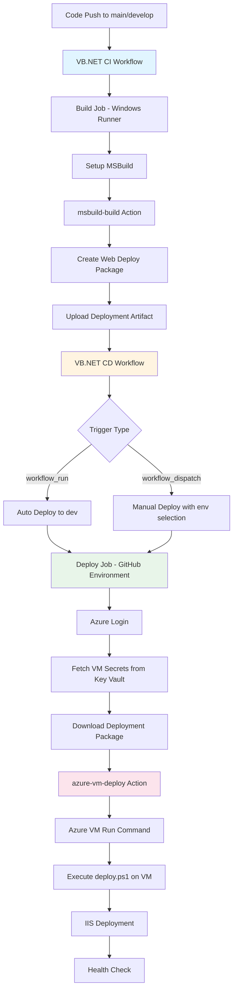
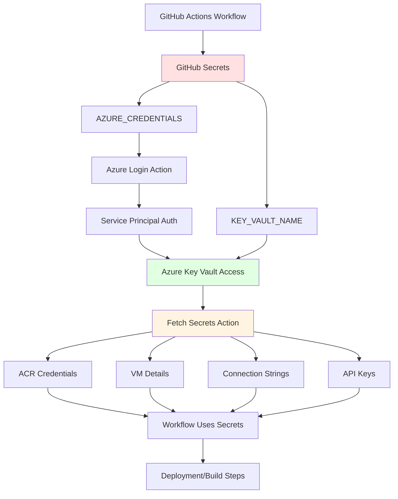
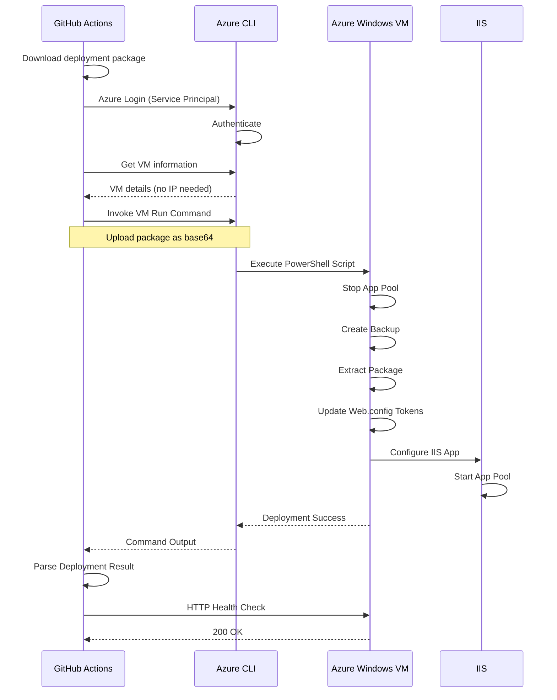
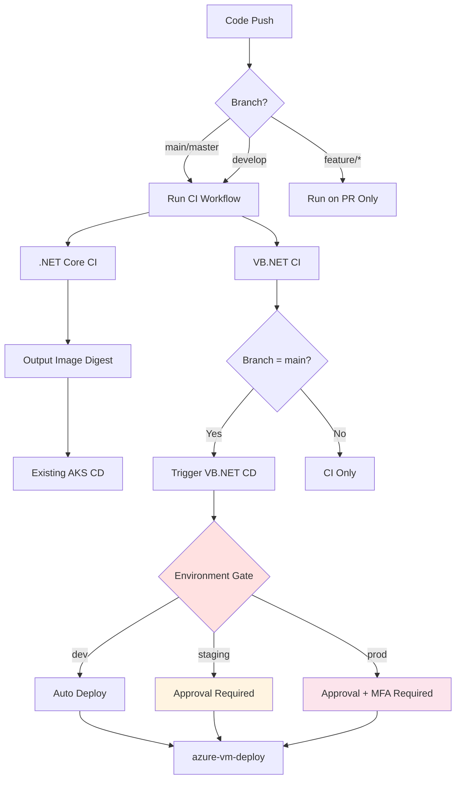
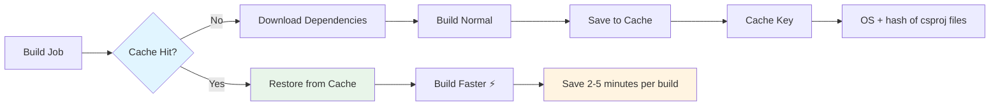
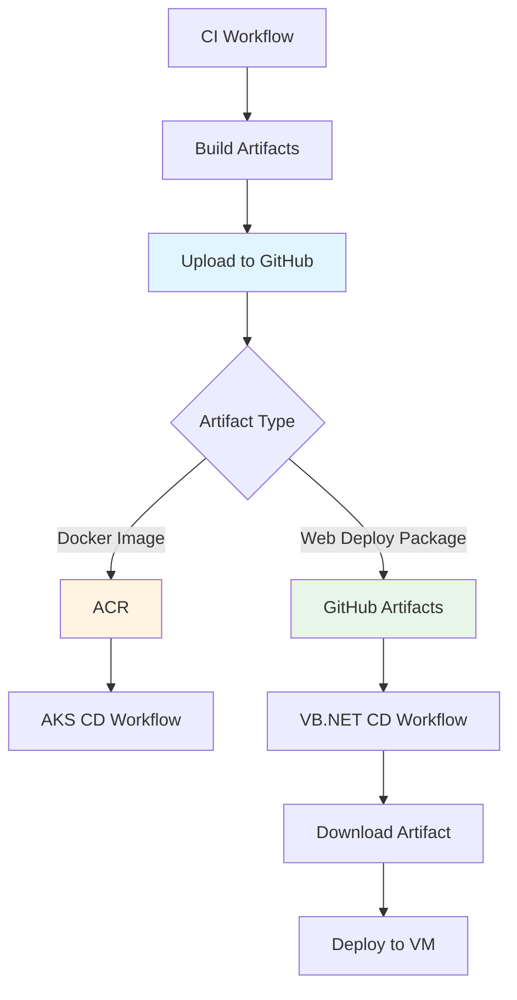

# Workflows Architecture

This document provides detailed architecture diagrams and explanations for the GitHub Actions CI/CD workflows implemented in this POC.

## Table of Contents

1. [.NET Core CI/CD Flow](#net-core-cicd-flow)
2. [VB.NET CI/CD Flow](#vbnet-cicd-flow)
3. [Reusable Actions Architecture](#reusable-actions-architecture)
4. [Secret Management Flow](#secret-management-flow)
5. [Azure VM Deployment Flow](#azure-vm-deployment-flow)

---

## .NET Core CI/CD Flow

The .NET Core workflow builds a containerized ASP.NET Core application and pushes it to Azure Container Registry for deployment to AKS.

```mermaid
graph TB
    A[Code Push to main/develop] --> B[.NET Core CI Workflow]
    B --> C[Build & Test Job]
    C --> D[Setup .NET 9.0]
    D --> E[dotnet-build Action]
    E --> F[dotnet-test Action]
    F --> G[Upload Test Results]

    B --> H[Build & Push to ACR Job]
    H --> I[Azure Login]
    I --> J[Fetch ACR Credentials from Key Vault]
    J --> K[Setup Docker Buildx]
    K --> L[docker/build-push-action@v5]
    L --> M[Push to ACR with Multiple Tags]
    M --> N[Output image-tag & image-digest]

    N --> O[Existing AKS CD Workflow]
    O --> P[Deploy to AKS Cluster]

    style B fill:#e1f5ff
    style H fill:#fff4e1
    style O fill:#f0f0f0
```

### Key Points

- **Runner**: ubuntu-latest (fast, cost-effective)
- **Caching**: NuGet packages, Docker layers (GitHub Actions cache)
- **Security**: Azure Key Vault for ACR credentials
- **Outputs**: Image tags and digest for CD workflow consumption
- **No Custom Docker Action**: Uses official `docker/build-push-action@v5`

---

## VB.NET CI/CD Flow

The VB.NET workflow builds a legacy .NET Framework application and deploys it to IIS on Azure Windows VM.



### Key Points

- **Runner**: windows-latest (required for MSBuild)
- **Deployment**: Azure VM Run Command (no WinRM, no ports)
- **Security**: Key Vault for all secrets, tokenized Web.config
- **Artifacts**: 90-day retention for deployment packages
- **Rollback**: Automatic on failure via PowerShell script

---

## Reusable Actions Architecture

Custom composite actions provide reusability across workflows and future applications.

```mermaid
graph LR
    A[Workflows] --> B[Custom Composite Actions]
    A --> C[GitHub Marketplace Actions]

    B --> D[dotnet-build]
    B --> E[dotnet-test]
    B --> F[msbuild-build]
    B --> G[azure-vm-deploy]

    D --> C
    E --> C
    F --> C
    G --> C

    C --> H[setup-dotnet@v4]
    C --> I[docker/build-push-action@v5]
    C --> J[Azure/get-keyvault-secrets@v1]
    C --> K[azure/login@v2]
    C --> L[setup-msbuild@v2]

    style B fill:#e1f5ff
    style C fill:#fff4e1
```

### Composite Actions Details

#### 1. dotnet-build
- **Purpose**: Build .NET applications with caching
- **Inputs**: dotnet-version, project-path, configuration
- **Features**: NuGet caching, dependency restoration
- **Used by**: .NET Core CI

#### 2. dotnet-test
- **Purpose**: Run tests with coverage
- **Inputs**: test-path, configuration, collect-coverage
- **Features**: Coverage reports, test result upload
- **Used by**: .NET Core CI

#### 3. msbuild-build
- **Purpose**: Build .NET Framework with MSBuild
- **Inputs**: solution-path, configuration, create-package
- **Features**: Web Deploy package creation, NuGet restore
- **Used by**: VB.NET CI

#### 4. azure-vm-deploy
- **Purpose**: Deploy to Azure Windows VM
- **Inputs**: keyvault-name, vm-name, deployment-package-path
- **Features**: VM Run Command, health checks, rollback
- **Used by**: VB.NET CD

---

## Secret Management Flow

Azure Key Vault centralizes all sensitive configuration with minimal GitHub Secrets.



### Benefits

- **Minimal GitHub Secrets**: Only 2 secrets in GitHub
- **Centralized Rotation**: Update secrets in Key Vault without workflow changes
- **Least Privilege**: Service principal with read-only Key Vault access
- **Audit Trail**: Key Vault logs all secret access

---

## Azure VM Deployment Flow

Azure VM Run Command provides secure deployment without WinRM or open ports.



### Why VM Run Command vs WinRM?

| Feature | VM Run Command ✅ | WinRM ❌ |
|---------|------------------|---------|
| Network Ports | None | 5985/5986 |
| Firewall Rules | None | Required |
| Public IP | Not needed | Required |
| Security | Azure-native | Credential exposure |
| Setup | Built-in | Manual config |
| NSG Rules | None | Must allow WinRM |

---

## Workflow Triggers & Gates



### Environment Protection Rules

- **dev**: No approvals, auto-deploy
- **staging**: 1 reviewer required
- **prod**: 2 reviewers + wait timer (30 min)

---

## Caching Strategy



### Cache Configuration

**NuGet Packages**:
```yaml
path: ~/.nuget/packages
key: ${{ runner.os }}-nuget-${{ hashFiles('**/*.csproj') }}
```

**Docker Layers**:
```yaml
cache-from: type=gha
cache-to: type=gha,mode=max
```

---

## Artifact Flow



### Retention Policies

- **Test Results**: 30 days
- **Build Outputs**: 30 days
- **Deployment Packages**: 90 days (VB.NET)
- **Docker Images**: Managed by ACR retention policy

---

## Summary

This architecture demonstrates:

- ✅ **Two Distinct Pipelines**: Modern (.NET Core) and Legacy (VB.NET)
- ✅ **Reusable Components**: 4 composite actions
- ✅ **Secure by Default**: Key Vault integration, VM Run Command
- ✅ **Extensible Design**: Easy to add environments and applications
- ✅ **Production-Ready**: Caching, rollback, health checks, approval gates

For implementation details, see the workflow files in [.github/workflows/](.github/workflows/) and composite actions in [.github/actions/](.github/actions/).
