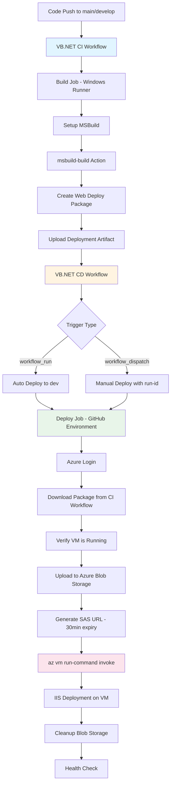
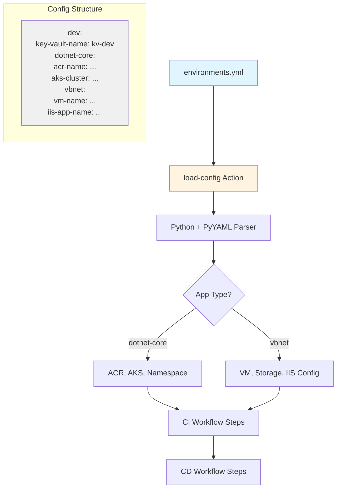
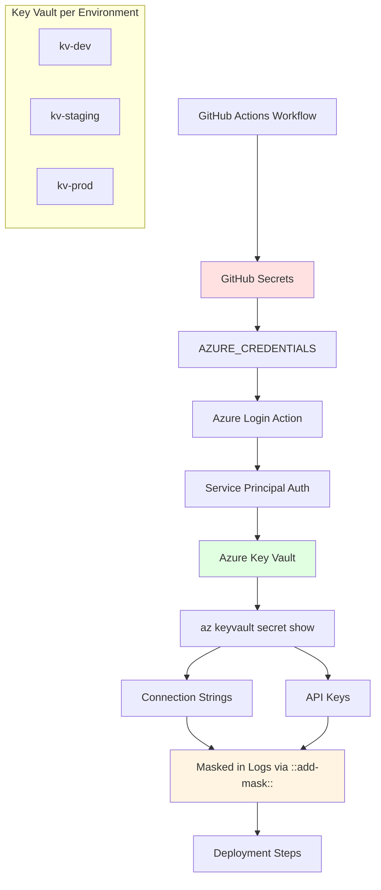
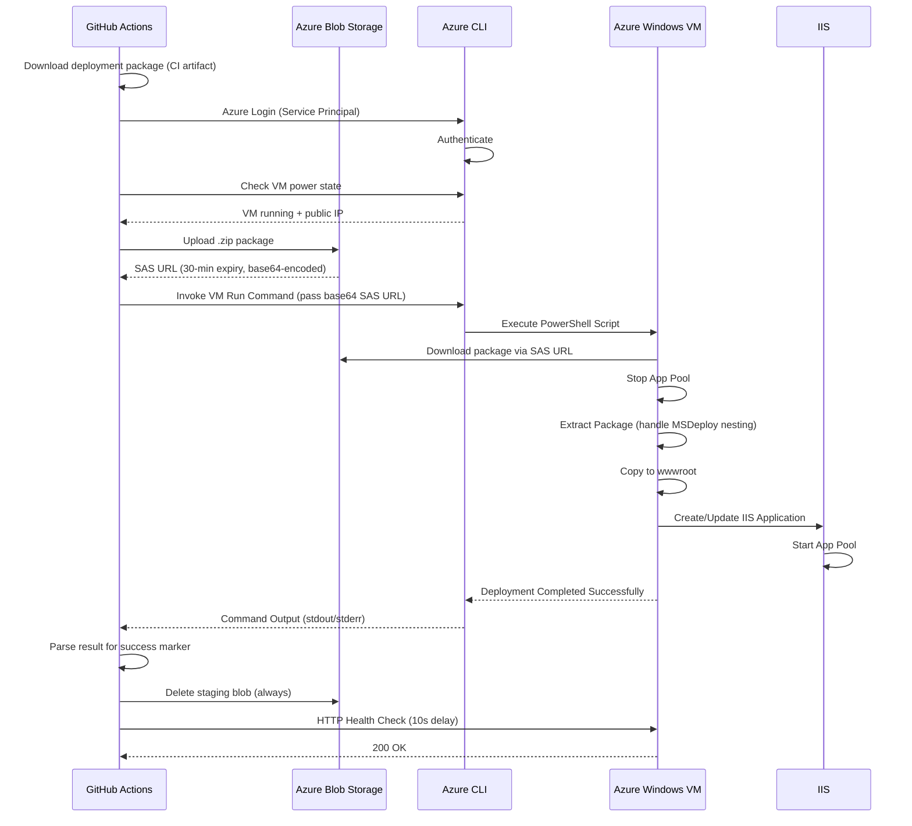
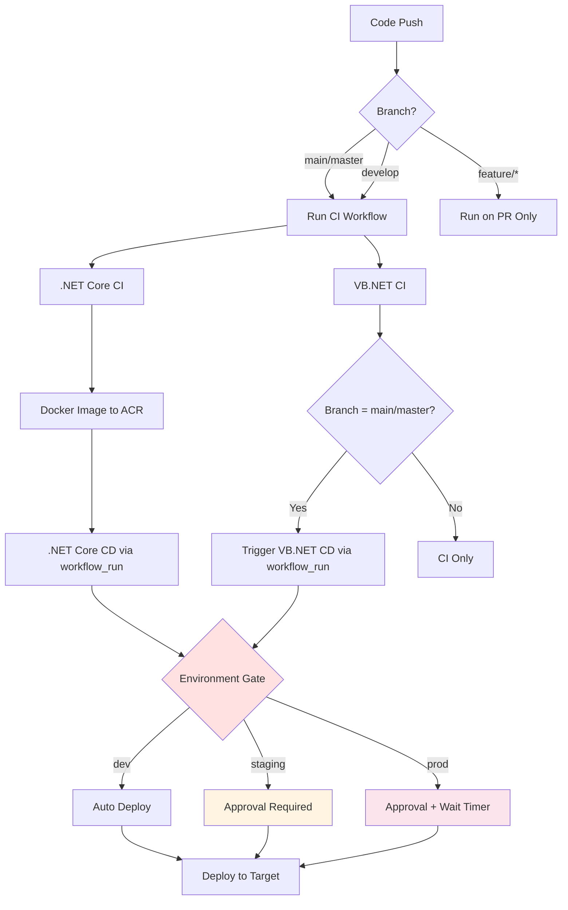
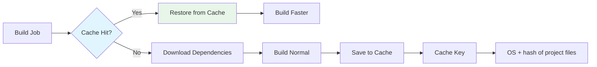
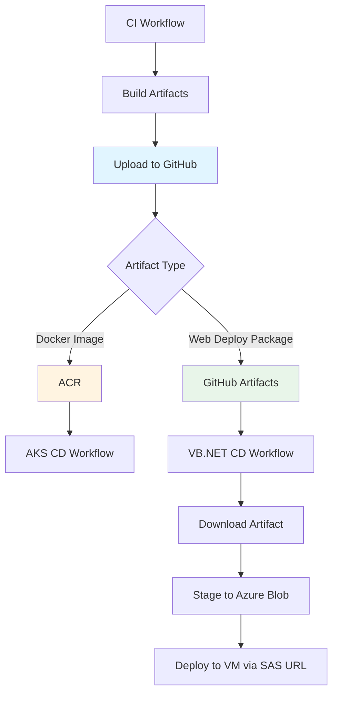

# Workflows Architecture

This document provides architecture diagrams, security guidance, extensibility patterns, and operational best practices for the GitHub Actions CI/CD workflows in this repository.

## Table of Contents

1. [.NET Core CI/CD Flow](#net-core-cicd-flow)
2. [VB.NET CI/CD Flow](#vbnet-cicd-flow)
3. [Reusable Actions Architecture](#reusable-actions-architecture)
4. [Environment Configuration Architecture](#environment-configuration-architecture)
5. [Secret Management Flow](#secret-management-flow)
6. [Azure VM Deployment Flow](#azure-vm-deployment-flow)
7. [Workflow Triggers & Gates](#workflow-triggers--gates)
8. [Caching Strategy](#caching-strategy)
9. [Artifact Flow](#artifact-flow)
10. [Extensibility Guide](#extensibility-guide)
11. [Security Hardening](#security-hardening)
12. [Operational Best Practices](#operational-best-practices)

---

## .NET Core CI/CD Flow

The .NET Core workflow builds a containerized ASP.NET Core 9.0 application, runs tests with code coverage, pushes the Docker image to Azure Container Registry, and deploys to AKS via a separate CD workflow.

```mermaid
graph TB
    A[Code Push to main/develop] --> B[.NET Core CI Workflow]
    B --> C[Build & Test Job]
    C --> D[Setup .NET 9.0]
    D --> E[dotnet-build Action]
    E --> F[dotnet-test Action]
    F --> G[Upload Test Results & Coverage]

    B --> H[Build & Push to ACR Job]
    H --> I[Load Environment Config]
    I --> J[Azure Login]
    J --> K[Setup Docker Buildx]
    K --> L[docker/build-push-action@v5]
    L --> M[Push to ACR with Multiple Tags]
    M --> N[Output image-tag & image-digest]

    N --> O[.NET Core CD Workflow]
    O --> P[Load Config & Determine Image Tag]
    P --> Q[Set AKS Context + kubelogin]
    Q --> R[kubectl apply with envsubst]
    R --> S[Wait for Rollout 300s]
    S --> T[Deployment Summary]

    style B fill:#e1f5ff
    style H fill:#fff4e1
    style O fill:#e8f5e9
```

### Key Design Decisions

- **Runner**: `ubuntu-latest` for both CI and CD (cost-effective, fast provisioning)
- **CI/CD separation**: CI (`dotnet-core-ci.yml`) produces the Docker image; CD (`dotnet-core-cd.yml`) deploys it. CD triggers via `workflow_run` on CI success or manual `workflow_dispatch`
- **Caching**: NuGet packages via `actions/cache@v4`, Docker layers via GitHub Actions cache (`type=gha,mode=max`)
- **Image tagging**: `latest` (default branch), `<branch>`, `<branch>-<sha>`, and `1.0.0-<sha>` semantic version
- **Deployment**: Kubernetes manifests use `envsubst` for `${IMAGE}`, `${NAMESPACE}`, `${ENVIRONMENT}` substitution
- **Health probes**: Startup (`/health`, 10 retries), liveness (`/health/live`), readiness (`/health/ready`)
- **Rolling update**: `maxSurge: 1`, `maxUnavailable: 0` ensures zero-downtime deployments

---

## VB.NET CI/CD Flow

The VB.NET workflow builds a legacy .NET Framework 4.8 application using MSBuild, creates a Web Deploy package, and deploys it to IIS on an Azure Windows VM via Blob Storage staging and VM Run Command.


```mermaid
graph TB
    A[Code Push to main/develop] --> B[VB.NET CI Workflow]
    B --> C[Build Job - Windows Runner]
    C --> D[Setup MSBuild]
    D --> E[msbuild-build Action]
    E --> F[Create Web Deploy Package]
    F --> G[Upload Deployment Artifact]

    G --> H[VB.NET CD Workflow]
    H --> I{Trigger Type}
    I -->|workflow_run| J[Auto Deploy to dev]
    I -->|workflow_dispatch| K[Manual Deploy with run-id]

    J & K --> L[Deploy Job - GitHub Environment]
    L --> M[Azure Login]
    M --> N[Download Package from CI Workflow]
    N --> O[Verify VM is Running]
    O --> P[Upload to Azure Blob Storage]
    P --> Q[Generate SAS URL - 30min expiry]
    Q --> R[az vm run-command invoke]
    R --> S[IIS Deployment on VM]
    S --> T[Cleanup Blob Storage]
    T --> U[Health Check]

    style B fill:#e1f5ff
    style H fill:#fff4e1
    style L fill:#e8f5e9
    style R fill:#fce4ec
```

### Key Design Decisions

- **Runner**: `windows-latest` for both CI (MSBuild requirement) and CD (PowerShell/Azure CLI)
- **CI/CD separation**: CI (`vbnet-ci.yml`) builds and packages; CD (`vbnet-cd.yml`) deploys. CD triggers via `workflow_run` or manual `workflow_dispatch` with optional run-id override
- **Package transfer**: CI artifacts are downloaded cross-workflow via `dawidd6/action-download-artifact@v3`, staged to Azure Blob Storage with a time-limited SAS URL, then downloaded on the VM
- **SAS URL encoding**: Base64-encoded to avoid `&` characters breaking parameter passing to VM Run Command
- **Deployment**: Azure VM Run Command executes an inline PowerShell script that handles IIS app pool management, package extraction, nested MSDeploy structure handling, and application configuration
- **Rollback**: The standalone `deploy.ps1` script creates timestamped backups and automatically restores on failure
- **Blob cleanup**: Runs with `always()` condition to remove transient packages regardless of deployment outcome

---

## Reusable Actions Architecture

Custom composite actions encapsulate build, test, and deployment logic as reusable units. Each action owns a single concern and can be composed into different workflows.

```mermaid
graph LR
    A[Workflows] --> B[Custom Composite Actions]
    A --> C[GitHub Marketplace Actions]

    B --> D[dotnet-build]
    B --> E[dotnet-test]
    B --> F[msbuild-build]
    B --> G[load-config]
    B --> H[azure-vm-deploy]

    D --> C
    E --> C
    F --> C
    G --> C
    H --> C

    C --> I[setup-dotnet@v4]
    C --> J[docker/build-push-action@v5]
    C --> K[azure/login@v2]
    C --> L[setup-msbuild@v2]
    C --> M[actions/cache@v4]
    C --> N[azure/aks-set-context@v4]

    style B fill:#e1f5ff
    style C fill:#fff4e1
```

### Composite Actions Catalog

| Action | Runner | Purpose | Key Inputs | Used By |
|--------|--------|---------|------------|---------|
| `dotnet-build` | Linux | Build .NET apps with NuGet caching | `dotnet-version`, `project-path`, `configuration` | .NET Core CI |
| `dotnet-test` | Linux | Run tests with optional XPlat Code Coverage | `test-path`, `configuration`, `collect-coverage` | .NET Core CI |
| `msbuild-build` | Windows | Build .NET Framework with MSBuild, create Web Deploy package | `solution-path`, `configuration`, `platform`, `create-package` | VB.NET CI |
| `load-config` | Any | Parse `environments.yml` and output per-environment values | `environment`, `app-type`, `config-path` | All CI/CD |
| `azure-vm-deploy` | Windows | Deploy to Azure Windows VM via Run Command with Key Vault integration | `keyvault-name`, `vm-name`, `resource-group`, `deployment-package-path` | VB.NET CD |

### Design Principles for Actions

1. **Single responsibility**: Each action does one thing (build, test, deploy, or configure)
2. **Parameterized with defaults**: All inputs have sensible defaults so callers only override what differs
3. **Environment variable passing**: Inputs flow through `env:` variables in `run:` blocks, never interpolated directly via `${{ }}` in shell scripts (prevents script injection)
4. **Artifact outputs**: Actions declare typed outputs that downstream jobs or steps can consume

---

## Environment Configuration Architecture

The `load-config` composite action provides a centralized, YAML-driven approach to environment parameterization, eliminating hardcoded values in workflows.


```mermaid
graph TB
    A[environments.yml] --> B[load-config Action]
    B --> C[Python + PyYAML Parser]

    C --> D{App Type?}
    D -->|dotnet-core| E[ACR, AKS, Namespace]
    D -->|vbnet| F[VM, Storage, IIS Config]

    E --> G[CI Workflow Steps]
    F --> G
    G --> H[CD Workflow Steps]

    subgraph "Config Structure"
        I["dev:
  key-vault-name: kv-dev
  dotnet-core:
    acr-name: ...
    aks-cluster: ...
  vbnet:
    vm-name: ...
    iis-app-name: ..."]
    end

    style A fill:#e1f5ff
    style B fill:#fff4e1
    style I fill:#f0f0f0
```

### Config Layering

```yaml
<environment>:                  # dev / staging / prod
  key-vault-name: <name>       # Shared across app types within the environment
  dotnet-core:                  # App-type specific
    acr-name: <fqdn>
    aks-cluster: <name>
    resource-group: <rg>
    namespace: <k8s-ns>
  vbnet:                        # App-type specific
    vm-name: <name>
    resource-group: <rg>
    storage-account: <name>
    iis-app-name: <name>
    iis-app-pool: <name>
```

**How it works**: The action receives `environment` and `app-type` inputs, installs PyYAML if needed, reads the config file, and writes all matching key-value pairs to `$GITHUB_OUTPUT`. Both environment-level (e.g., `key-vault-name`) and app-type-level values are emitted.

**Adding a new environment**: Add a new top-level key to `environments.yml` with the required fields. No workflow changes needed.

---

## Secret Management Flow

Azure Key Vault centralizes all sensitive configuration. Only a single service principal credential is stored in GitHub Secrets.


```mermaid
graph TB
    A[GitHub Actions Workflow] --> B[GitHub Secrets]
    B --> C[AZURE_CREDENTIALS]

    C --> E[Azure Login Action]
    E --> F[Service Principal Auth]

    F --> G[Azure Key Vault]

    G --> H[az keyvault secret show]
    H --> I[Connection Strings]
    H --> J[API Keys]

    I & J --> K[Masked in Logs via ::add-mask::]
    K --> L[Deployment Steps]

    subgraph "Key Vault per Environment"
        M[kv-dev]
        N[kv-staging]
        O[kv-prod]
    end

    style B fill:#ffe1e1
    style G fill:#e1ffe1
    style K fill:#fff4e1
```

### Current Implementation

- **GitHub Secrets surface area**: One secret (`AZURE_CREDENTIALS`) containing service principal JSON
- **Runtime secret fetch**: Azure CLI `az keyvault secret show` after `azure/login`
- **Secret masking**: `::add-mask::` ensures secrets never appear in workflow logs
- **Key Vault per environment**: Each environment has its own vault (`kv-dev`, `kv-staging`, `kv-prod`), enabling isolation

### Recommended: Migrate to OIDC Federated Identity

The current approach uses a long-lived service principal secret stored as `AZURE_CREDENTIALS`. The recommended improvement is to migrate to **OpenID Connect (OIDC) federated identity credentials**, which eliminates stored secrets entirely:

```yaml
# Current (long-lived secret)
- uses: azure/login@v2
  with:
    creds: ${{ secrets.AZURE_CREDENTIALS }}

# Recommended (OIDC - no stored secrets)
permissions:
  id-token: write
  contents: read
- uses: azure/login@v2
  with:
    client-id: ${{ secrets.AZURE_CLIENT_ID }}
    tenant-id: ${{ secrets.AZURE_TENANT_ID }}
    subscription-id: ${{ secrets.AZURE_SUBSCRIPTION_ID }}
```

**Benefits of OIDC**:
- No long-lived credentials to rotate
- Tokens are short-lived and scoped to the workflow run
- Eliminates the risk of credential exfiltration from GitHub Secrets
- Azure AD can enforce conditional access policies on the federated identity

---

## Azure VM Deployment Flow

Azure VM Run Command provides secure deployment without WinRM or open management ports.


```mermaid
sequenceDiagram
    participant GH as GitHub Actions
    participant Blob as Azure Blob Storage
    participant AZ as Azure CLI
    participant VM as Azure Windows VM
    participant IIS as IIS

    GH->>GH: Download deployment package (CI artifact)
    GH->>AZ: Azure Login (Service Principal)
    AZ->>AZ: Authenticate
    GH->>AZ: Check VM power state
    AZ-->>GH: VM running + public IP

    GH->>Blob: Upload .zip package
    Blob-->>GH: SAS URL (30-min expiry, base64-encoded)

    GH->>AZ: Invoke VM Run Command (pass base64 SAS URL)
    AZ->>VM: Execute PowerShell Script
    VM->>Blob: Download package via SAS URL
    VM->>VM: Stop App Pool
    VM->>VM: Extract Package (handle MSDeploy nesting)
    VM->>VM: Copy to wwwroot
    VM->>IIS: Create/Update IIS Application
    IIS->>IIS: Start App Pool
    VM-->>AZ: Deployment Completed Successfully
    AZ-->>GH: Command Output (stdout/stderr)

    GH->>GH: Parse result for success marker
    GH->>Blob: Delete staging blob (always)
    GH->>VM: HTTP Health Check (10s delay)
    VM-->>GH: 200 OK
```

### Why Azure Blob Storage + VM Run Command?

| Feature | Blob + VM Run Command | WinRM | Base64 Inline |
|---------|----------------------|-------|---------------|
| Network ports required | None | 5985/5986 | None |
| Package size limit | Unlimited (blob) | N/A | ~96KB (Run Command limit) |
| Security | Azure-native auth, SAS expiry | Credential exposure | Script size constraints |
| Cleanup | Automatic (always block) | N/A | N/A |
| Setup complexity | Built-in | Manual config | Built-in but fragile |

The Blob Storage staging approach was chosen over inline base64 encoding to handle arbitrarily large deployment packages. SAS URLs are time-limited (30 minutes) and base64-encoded for safe parameter passing.

---

## Workflow Triggers & Gates


```mermaid
graph TB
    A[Code Push] --> B{Branch?}
    B -->|main/master| C[Run CI Workflow]
    B -->|develop| C
    B -->|feature/*| D[Run on PR Only]

    C --> E[.NET Core CI]
    C --> F[VB.NET CI]

    E --> G[Docker Image to ACR]
    G --> H[.NET Core CD via workflow_run]

    F --> I{Branch = main/master?}
    I -->|Yes| J[Trigger VB.NET CD via workflow_run]
    I -->|No| K[CI Only]

    J --> L{Environment Gate}
    H --> L
    L -->|dev| M[Auto Deploy]
    L -->|staging| N[Approval Required]
    L -->|prod| O[Approval + Wait Timer]

    M & N & O --> P[Deploy to Target]

    style L fill:#ffe1e1
    style N fill:#fff4e1
    style O fill:#fce4ec
```

### Environment Protection Rules

| Environment | Approvals | Wait Timer | Branch Restriction |
|-------------|-----------|------------|-------------------|
| `dev` | None (auto-deploy) | None | `main`, `master` |
| `staging` | 1 reviewer | None | `main`, `master` |
| `prod` | 2 reviewers | 30 minutes | `main`, `master` |

### Path Filters

Each CI workflow uses path filters to avoid unnecessary runs:

| Workflow | Paths Watched |
|----------|---------------|
| .NET Core CI | `src/DotNetCoreApp/**`, `.github/workflows/dotnet-core-ci.yml`, `.github/actions/dotnet-build/**`, `.github/actions/dotnet-test/**` |
| VB.NET CI | `src/VBNetApp/**`, `.github/workflows/vbnet-ci.yml`, `.github/actions/msbuild-build/**` |

---

## Caching Strategy


```mermaid
graph LR
    A[Build Job] --> B{Cache Hit?}
    B -->|Yes| C[Restore from Cache]
    B -->|No| D[Download Dependencies]

    C --> E[Build Faster]
    D --> F[Build Normal]
    F --> G[Save to Cache]

    G --> H[Cache Key]
    H --> I["OS + hash of project files"]

    style B fill:#e1f5ff
    style C fill:#e8f5e9
```

### Cache Configuration

| Pipeline | Cache Target | Path | Key Strategy |
|----------|-------------|------|-------------|
| .NET Core | NuGet packages | `~/.nuget/packages` | `runner.os`-nuget-`hashFiles('**/*.csproj', '**/*.vbproj')` |
| .NET Core | Docker layers | GitHub Actions cache | `type=gha,mode=max` (via Buildx) |
| VB.NET | NuGet packages | `~/.nuget/packages` | `runner.os`-nuget-`hashFiles('**/*.config', '**/*.sln')` |

### Cache Invalidation

- NuGet cache invalidates when any `.csproj`, `.vbproj`, `.config`, or `.sln` file changes
- Docker layer cache uses `mode=max` to cache all layers, not just the final image
- Fallback restore keys (`runner.os-nuget-`) allow partial cache hits when only some packages changed

---

## Artifact Flow


```mermaid
graph TB
    A[CI Workflow] --> B[Build Artifacts]
    B --> C[Upload to GitHub]

    C --> D{Artifact Type}
    D -->|Docker Image| E[ACR]
    D -->|Web Deploy Package| F[GitHub Artifacts]

    E --> G[AKS CD Workflow]
    F --> H[VB.NET CD Workflow]

    H --> I[Download Artifact]
    I --> J[Stage to Azure Blob]
    J --> K[Deploy to VM via SAS URL]

    style C fill:#e1f5ff
    style E fill:#fff4e1
    style F fill:#e8f5e9
```

### Retention Policies

| Artifact | Storage | Retention |
|----------|---------|-----------|
| Test results (`.trx`) | GitHub Artifacts | 30 days |
| Coverage reports (`cobertura.xml`) | GitHub Artifacts | 30 days |
| Build outputs | GitHub Artifacts | 30 days |
| Deployment packages (`.zip`) | GitHub Artifacts | 90 days |
| Docker images | Azure Container Registry | ACR policy |
| Staging blobs | Azure Blob Storage | ~30 minutes (cleaned up per run) |

---

## Extensibility Guide

This section describes how to extend the pipelines for new applications, environments, and cross-repository reuse.

### Adding a New Application

#### Scenario: Second .NET Core API

1. **Create the application** under `src/NewApp/`
2. **Create a new CI workflow** (`new-app-ci.yml`) that references the existing composite actions:

```yaml
# .github/workflows/new-app-ci.yml
name: NewApp CI
on:
  push:
    branches: [main, develop, master]
    paths: ['src/NewApp/**']

env:
  DOTNET_VERSION: '9.0.x'
  PROJECT_PATH: 'src/NewApp/NewApp.sln'
  TEST_PATH: 'src/NewApp/NewApp.Tests/NewApp.Tests.csproj'
  IMAGE_NAME: 'new-app'

jobs:
  build-and-test:
    runs-on: ubuntu-latest
    steps:
      - uses: actions/checkout@v4
      - uses: ./.github/actions/dotnet-build
        with:
          project-path: ${{ env.PROJECT_PATH }}
      - uses: ./.github/actions/dotnet-test
        with:
          test-path: ${{ env.TEST_PATH }}
```

3. **Add environment config** to `environments.yml` under each environment (or reuse `dotnet-core` if sharing infrastructure)
4. **Add K8s manifests** under `k8s/newapp/`
5. **Create a CD workflow** following the pattern in `dotnet-core-cd.yml`

The composite actions (`dotnet-build`, `dotnet-test`, `load-config`) require no changes.

#### Scenario: Second VB.NET Application

Follow the same pattern, referencing `msbuild-build` and adding VB.NET-specific config to `environments.yml`.

### Adding a New Environment

1. **Add the environment block** to `environments.yml`:

```yaml
uat:
  key-vault-name: kv-uat
  dotnet-core:
    acr-name: myacruat.azurecr.io
    aks-cluster: aks-uat
    resource-group: rg-uat
    namespace: uat
    image-tag-suffix: uat
  vbnet:
    vm-name: vm-vbnet-uat
    resource-group: rg-uat
    storage-account: stvbnetuat
    storage-container: deployments
    iis-site: Default Web Site
    iis-app-name: VBNetApp-UAT
    iis-app-pool: VBNetAppPool-UAT
```

2. **Create the GitHub Environment** in repository settings with appropriate protection rules
3. **Add a deployment job** in the CD workflow referencing `environment: uat`
4. **Provision infrastructure** using existing Terraform modules (update `terraform.tfvars`)

No workflow logic changes are needed -- the `load-config` action dynamically reads whatever environment is requested.

### Converting to Reusable Workflows (`workflow_call`)

For cross-repository reuse, convert CI workflows to callable workflows:

```yaml
# .github/workflows/dotnet-core-ci-reusable.yml
name: .NET Core CI (Reusable)
on:
  workflow_call:
    inputs:
      dotnet-version:
        type: string
        default: '9.0.x'
      project-path:
        type: string
        required: true
      test-path:
        type: string
        required: true
      image-name:
        type: string
        required: true
    secrets:
      AZURE_CREDENTIALS:
        required: true

jobs:
  build-and-test:
    runs-on: ubuntu-latest
    steps:
      - uses: actions/checkout@v4
      - uses: ./.github/actions/dotnet-build
        with:
          dotnet-version: ${{ inputs.dotnet-version }}
          project-path: ${{ inputs.project-path }}
      - uses: ./.github/actions/dotnet-test
        with:
          test-path: ${{ inputs.test-path }}
```

Callers in other repositories would use:

```yaml
jobs:
  ci:
    uses: org/shared-workflows/.github/workflows/dotnet-core-ci-reusable.yml@main
    with:
      project-path: 'src/MyApp/MyApp.sln'
      test-path: 'src/MyApp/MyApp.Tests/MyApp.Tests.csproj'
      image-name: 'my-app'
    secrets:
      AZURE_CREDENTIALS: ${{ secrets.AZURE_CREDENTIALS }}
```

### Matrix Strategy for Multi-Version Testing

To test against multiple .NET versions or platforms:

```yaml
jobs:
  build-and-test:
    strategy:
      matrix:
        dotnet-version: ['8.0.x', '9.0.x']
        os: [ubuntu-latest]
    runs-on: ${{ matrix.os }}
    steps:
      - uses: actions/checkout@v4
      - uses: ./.github/actions/dotnet-build
        with:
          dotnet-version: ${{ matrix.dotnet-version }}
          project-path: ${{ env.PROJECT_PATH }}
```

---

## Security Hardening

This section documents the current security posture and provides actionable recommendations to harden the pipelines.

### Current Security Measures

| Measure | Status | Details |
|---------|--------|---------|
| Centralized secrets in Key Vault | Implemented | Only `AZURE_CREDENTIALS` in GitHub; all app secrets in Key Vault |
| Environment variable passing in scripts | Implemented | Inputs flow through `env:` in `run:` blocks, not direct `${{ }}` interpolation |
| No `eval` in scripts | Implemented | All `dotnet`/`msbuild` commands called directly |
| Azure CLI for Key Vault | Implemented | Uses `az keyvault secret show` instead of deprecated `Azure/get-keyvault-secrets@v1` |
| Secret masking | Implemented | `::add-mask::` used for secrets fetched at runtime |
| Non-root container | Implemented | Docker image runs as `appuser` (UID 1000) on port 8080 |
| VM Run Command (no WinRM) | Implemented | Zero open management ports on VM |
| SAS URL expiry | Implemented | Blob storage SAS tokens expire after 30 minutes |
| Blob cleanup | Implemented | Staging blobs deleted in `always()` step |
| Path filters | Implemented | Workflows only trigger on relevant source changes |
| GitHub Environment gates | Implemented | `dev` environment used; staging/prod gates defined |

### Recommended Improvements

#### 1. Add Explicit Permissions Blocks (High Priority)

Every workflow should declare minimum required `GITHUB_TOKEN` permissions. Without explicit permissions, the token defaults to broad access.

```yaml
# Add to every workflow file at the top level
permissions:
  contents: read          # Read repository contents
  id-token: write         # Required for OIDC (if adopted)

# Or per-job for finer control
jobs:
  build:
    permissions:
      contents: read
      checks: write       # Only if writing check annotations
```

**Recommended permissions per workflow:**

| Workflow | Permissions Needed |
|----------|-------------------|
| `dotnet-core-ci.yml` | `contents: read`, `packages: read` |
| `dotnet-core-cd.yml` | `contents: read`, `id-token: write` (for OIDC) |
| `vbnet-ci.yml` | `contents: read` |
| `vbnet-cd.yml` | `contents: read`, `actions: read` (for artifact download) |

#### 2. Pin Third-Party Actions to SHA (High Priority)

Mutable version tags (`@v4`) can be overwritten. Pin to full commit SHAs and use Dependabot or Renovate to manage updates.

```yaml
# Current (mutable tag - vulnerable to tag hijacking)
- uses: actions/checkout@v4

# Recommended (immutable SHA)
- uses: actions/checkout@b4ffde65f46336ab88eb53be808477a3936bae11 # v4.1.7
```

Create a `.github/dependabot.yml` to automate SHA updates:

```yaml
version: 2
updates:
  - package-ecosystem: "github-actions"
    directory: "/"
    schedule:
      interval: "weekly"
    groups:
      actions:
        patterns: ["*"]
```

#### 3. Migrate to OIDC Federated Identity (Medium Priority)

Replace the `AZURE_CREDENTIALS` JSON blob with OIDC federated identity (see [Secret Management Flow](#secret-management-flow) for details). This eliminates long-lived secrets from GitHub entirely.

#### 4. Add Concurrency Controls (Medium Priority)

Prevent parallel deployments to the same environment:

```yaml
# CI workflows: cancel superseded runs
concurrency:
  group: ${{ github.workflow }}-${{ github.ref }}
  cancel-in-progress: true

# CD workflows: serialize deployments per environment
concurrency:
  group: deploy-${{ github.workflow }}-dev
  cancel-in-progress: false   # Don't cancel in-progress deployments
```

#### 5. Secure the VB.NET Health Check (Low Priority)

The current health check uses HTTP. For production:
- Provision a TLS certificate on the IIS VM
- Configure HTTPS bindings in IIS
- Update health check URL to `https://`
- Add certificate renewal automation (e.g., Let's Encrypt via `win-acme`)

### Security Anti-Patterns to Avoid

| Anti-Pattern | Why It's Dangerous | What to Do Instead |
|-------------|-------------------|-------------------|
| `${{ github.event.pull_request.title }}` in `run:` | PR titles are user-controlled; allows script injection | Pass through `env:` variable |
| `eval "$COMMAND"` in shell scripts | Executes arbitrary code if any input is tainted | Call commands directly with arguments |
| Secrets in inline script strings | May leak to logs on script error | Use `env:` + `::add-mask::` |
| `actions/checkout` with `persist-credentials: true` (default) | Leaves git credentials accessible to subsequent steps | Set `persist-credentials: false` when not needed |
| Wildcard `permissions: write-all` | Grants maximum token access | Declare minimum per-job permissions |
| Using `pull_request_target` without restrictions | Runs untrusted fork code with write access | Use `pull_request` event or require approval for forks |

---

## Operational Best Practices

### Job Timeouts

Set explicit timeouts on every job to prevent runaway resource consumption:

```yaml
jobs:
  build-and-test:
    runs-on: ubuntu-latest
    timeout-minutes: 20        # Build + test should complete in 20min

  build-and-push-to-acr:
    runs-on: ubuntu-latest
    timeout-minutes: 30        # Docker build + push

  deploy-dev:
    runs-on: ubuntu-latest
    timeout-minutes: 15        # AKS deployment

  deploy-dev-vbnet:
    runs-on: windows-latest
    timeout-minutes: 30        # VM deployment (includes blob upload, Run Command)
```

### Concurrency Groups

```yaml
# CI: Cancel previous runs when new commits are pushed
concurrency:
  group: ci-${{ github.workflow }}-${{ github.ref }}
  cancel-in-progress: true

# CD: Never cancel in-progress deployments; queue them
concurrency:
  group: cd-${{ github.workflow }}-dev
  cancel-in-progress: false
```

### Step Summary Best Practices

All workflows write to `$GITHUB_STEP_SUMMARY` for visibility. This provides:
- Build configuration and commit info (CI)
- Image tags and digests (.NET Core CI)
- Pod status and service info (.NET Core CD)
- VM name, app URL, and deployment status (VB.NET CD)

### Runner Selection

| Workload | Runner | Rationale |
|----------|--------|-----------|
| .NET Core build/test | `ubuntu-latest` | `dotnet` CLI is cross-platform; Linux runners are faster and cheaper |
| Docker build/push | `ubuntu-latest` | Native Docker support |
| AKS deployment | `ubuntu-latest` | `kubectl` and Azure CLI available |
| MSBuild / VB.NET build | `windows-latest` | MSBuild for .NET Framework requires Windows |
| VB.NET CD | `windows-latest` | PowerShell with Azure CLI; could potentially migrate to `ubuntu-latest` since only `az` CLI and `pwsh` are used |

### Monitoring and Observability

**Currently implemented:**
- GitHub Step Summaries for all workflows
- Kubernetes health probes (startup, liveness, readiness)
- HTTP health check for VB.NET deployments
- Detailed deployment logging in PowerShell scripts

**Recommended additions:**
- GitHub Actions workflow run notifications (Slack/Teams integration)
- Deployment frequency and failure rate tracking
- Application Insights or Prometheus integration for runtime monitoring
- Azure Monitor alerts on VM health and IIS availability
- Container image vulnerability scanning in CI (e.g., `trivy-action`)

### Versioning Strategy

**Current**: Static `1.0.0-<short-sha>` for Docker images.

**Recommended evolution:**

| Approach | When to Use | Example |
|----------|------------|---------|
| SHA-based (current) | Development/POC | `1.0.0-abc1234` |
| Git tag-based | Release-driven projects | `v2.3.1` (from git tag) |
| CalVer | Time-based releases | `2026.02.1-abc1234` |
| Auto-increment | Continuous delivery | `1.2.345` (build number) |

---

## Summary

| Principle | Implementation |
|-----------|---------------|
| **Two Distinct Pipelines** | Modern (.NET Core to AKS) and Legacy (VB.NET to IIS/VM) |
| **Reusable Components** | 5 composite actions (`dotnet-build`, `dotnet-test`, `msbuild-build`, `load-config`, `azure-vm-deploy`) |
| **Centralized Configuration** | `environments.yml` parsed by `load-config` action; add environments without workflow changes |
| **Secure by Default** | Key Vault integration, `env:` variable passing, VM Run Command, SAS URL expiry, secret masking |
| **Extensible Design** | New apps reuse existing actions; new environments require only config; `workflow_call` ready |
| **Production-Ready** | Caching, rollback, health checks, approval gates, path filters |

### Quick Reference: What to Do When...

| Task | Steps |
|------|-------|
| Add a new .NET Core app | Create src, add workflow referencing `dotnet-build`/`dotnet-test`, add K8s manifests, add config to `environments.yml` |
| Add a new VB.NET app | Create src, add workflow referencing `msbuild-build`, add config to `environments.yml` |
| Add a new environment | Add block to `environments.yml`, create GitHub Environment, add CD job |
| Promote to staging/prod | Create deployment job with `environment: staging`, configure approval rules in GitHub |
| Share workflows cross-repo | Convert to `workflow_call` reusable workflows (see [Extensibility Guide](#converting-to-reusable-workflows-workflow_call)) |
| Rotate Azure credentials | Update Key Vault secrets (no workflow changes); if using OIDC, no rotation needed |
| Debug a failed deployment | Check Step Summary, review VM Run Command stdout/stderr, inspect blob storage logs |

For detailed design specifications, see the [CI/CD Design Document](../design/cicd-design-document.md). For the full review of findings, see [WORKFLOW_REVIEW.md](../../WORKFLOW_REVIEW.md).
